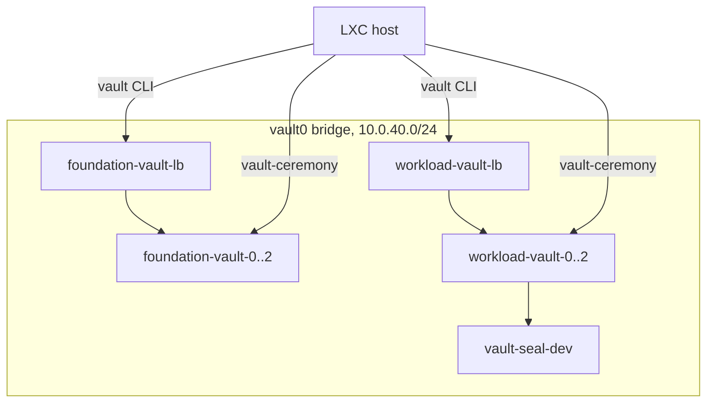

# Trying It on LXC

Both clusters on eight LXC containers on one Debian host, all on one bridge, with Ansible, vault-ceremony and the vault CLI on the host. `foundation-vault/` and `workload-vault/` at the top of this repository are the clusters' vault-ceremony repositories, and where the offline CA's work is done for this test bed. One shell plays every person: [pgp-personas](https://github.com/zinrai/pgp-personas) makes their keys, and `pgp-personas decrypt --as <name>` is that person's own decryption. [mkcert](https://github.com/FiloSottile/mkcert) plays the offline CA.



## Prerequisites

On the host:

```bash
$ sudo apt install lxc lxc-templates debootstrap nftables ansible mkcert
```

And on `PATH`: [netshed](https://github.com/zinrai/netshed), [declxc](https://github.com/zinrai/declxc), [deb-rootfs](https://github.com/zinrai/deb-rootfs), [vault-ceremony](https://github.com/zinrai/vault-ceremony/releases), [pgp-personas](https://github.com/zinrai/pgp-personas/releases), and the [vault](https://releases.hashicorp.com/vault/) CLI.

## Containers

Create them, give root your SSH key and the SSH server and Python that Ansible needs, and leave networking to LXC, which assigns the static IPs:

```bash
$ sudo netshed create -config network.yaml
$ sudo declxc create -f containers.yaml
$ for n in $(grep -oP '(?<=name: )\S+' containers.yaml); do
    sudo deb-rootfs.py packages        --dir /var/lib/lxc/$n/rootfs --name openssh-server python3
    sudo deb-rootfs.py authorized_keys --dir /var/lib/lxc/$n/rootfs --user root
    sudo deb-rootfs.py interfaces      --dir /var/lib/lxc/$n/rootfs
  done
$ sudo declxc start -f containers.yaml
```

Once their SSH servers are up, trust their host keys:

```bash
$ grep -oP '(?<=ipv4_address: )[^/]+' containers.yaml | ssh-keyscan -t ed25519 -f - >> ~/.ssh/known_hosts
```

## foundation-vault

Make the holders' keys, then from the cluster's CA in `ca/`, which mkcert makes the first time, each node's certificate for its own address and the load balancer's, straight into where the playbook takes them from. vault-ceremony reads the CA as `ca/root.crt`:

```bash
$ cd foundation-vault && . ./env
$ for p in alice bob carol safe-hq safe-dc2; do pgp-personas person --name $p --pubkey pubkeys/$p.gpg; done
$ for n in 0 1 2; do d=../ansible/standard/roles/vault_conf/files/foundation-vault-$n/etc/vault.d/tls; mkdir -p $d && mkcert -ecdsa -cert-file $d/server.crt -key-file $d/server.key 10.0.40.1$n 10.0.40.5 && cp ca/rootCA.pem $d/ca.crt; done
$ cp ca/rootCA.pem ca/root.crt
$ install -D -m 0644 ca/root.crt ../ansible/standard/roles/haproxy_conf/files/foundation-vault-lb/etc/haproxy/vault-ca.crt
```

Run the playbook, then the ceremonies:

```bash
$ (cd ../ansible/foundation-vault && ansible-playbook foundation-vault.yml)
$ vault-ceremony init
$ for h in alice bob carol; do vault-ceremony key --as $h | pgp-personas decrypt --as $h | vault-ceremony unseal --node foundation-vault-0 --as $h; done
$ for h in alice bob carol; do vault-ceremony key --as $h | pgp-personas decrypt --as $h | vault-ceremony unseal --as $h; done     # again if a node has not joined yet
$ vault-ceremony initial-root-token --as alice | pgp-personas decrypt --as alice | vault-ceremony bootstrap --as alice
```

Log in through the load balancer as alice, with their initial password:

```bash
$ pgp-personas decrypt --as alice < state/passwords/alice.asc
$ vault login -method=userpass username=alice
```

## workload-vault

The same, with the development seal's key made and placed too. The seal unseals every node:

```bash
$ cd ../workload-vault && . ./env
$ for p in alice bob carol safe-hq safe-dc2; do pgp-personas person --name $p --pubkey pubkeys/$p.gpg; done
$ for n in 0 1 2; do d=../ansible/standard/roles/vault_conf/files/workload-vault-$n/etc/vault.d/tls; mkdir -p $d && mkcert -ecdsa -cert-file $d/server.crt -key-file $d/server.key 10.0.40.2$n 10.0.40.15 && cp ca/rootCA.pem $d/ca.crt; done
$ cp ca/rootCA.pem ca/root.crt
$ install -D -m 0644 ca/root.crt ../ansible/standard/roles/haproxy_conf/files/workload-vault-lb/etc/haproxy/vault-ca.crt
$ pgp-personas secret-key --name 'workload-vault development seal' --out seal-key/key.gpg
$ for n in 0 1 2; do install -D -m 0600 seal-key/key.gpg ../ansible/standard/roles/vault-seal-dev_conf/files/workload-vault-$n/etc/vault-seal-dev/key.gpg; done
$ (cd ../ansible/workload-vault && ansible-playbook workload-vault.yml)
$ vault-ceremony init
$ vault-ceremony initial-root-token --as alice | pgp-personas decrypt --as alice | vault-ceremony bootstrap --as alice
```

## Things to Try

Restart a workload-vault node: it comes back unsealed. Restart a foundation-vault node: it comes back sealed, the load balancer routes around it, and `vault-ceremony status` shows the holders what to run.

```bash
$ ssh root@10.0.40.20 systemctl restart vault
$ ssh root@10.0.40.10 systemctl restart vault
```

The audit log names the client, the host's 10.0.40.1, never the load balancer's 10.0.40.5, though the vault CLI went through it:

```bash
$ for i in 10 11 12; do ssh root@10.0.40.$i cat /var/log/vault/audit.log 2>/dev/null; done | grep -o '"remote_address":"[^"]*"' | sort | uniq -c
```

Break-glass, restarting and upgrading are in the [README](../README.md#operations).

## Tear Down

```bash
$ sudo declxc destroy -f containers.yaml
$ sudo netshed delete -config network.yaml
```
